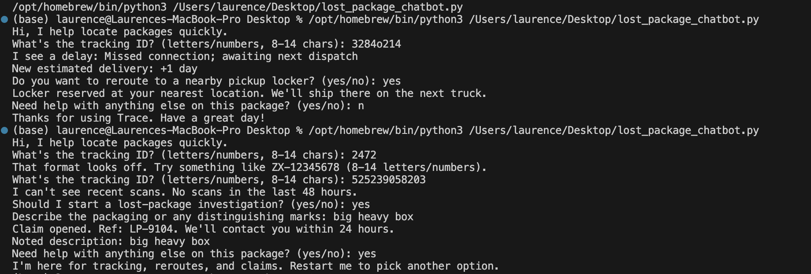
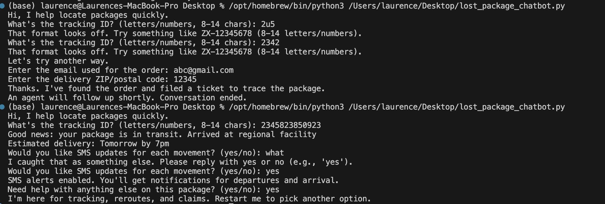

# Lost Package Chatbot

This project is a simple **command-line chatbot** that helps users track a **lost, delayed, or in-transit package**.  
It demonstrates conversation design, error handling, and clean Python structure using a small but realistic prototype.

---

## 1. Setup & Installation

### Prerequisites

- Python **3.8+** installed  

### Project Files

Place your chatbot code in a file, for example:

```text
project/
  lost_package_chatbot.py
```

> The chatbot uses only the **Python standard library** (`dataclasses`, `typing`, `sys`, `random`),  
> so no extra packages are required.

### Run the Chatbot

From the project directory:

```bash
python3 lost_package_chatbot.py
```

You should see something like:

```text
Hi, I help locate packages quickly.
What's the tracking ID? (letters/numbers, 8-14 chars):
```

You can exit at any time by:

- Pressing `Ctrl + C`

---

## 2. Brief Explanation of the Approach

### Conversation & UX Design

The chatbot persona is a friendly assistant focused on **package tracking**:

1. **Start with the tracking ID**
   - The user is greeted and asked for a **tracking ID**.
   - The ID is checked with a lightweight validator:  
     `looks_like_tracking()` ensures:
     - Alphanumeric (ignoring `-`)
     - Length between 8 and 14 characters.

2. **Status-based branching**
   - A helper method, `derive_status(tracking_id)`, returns a `PackageStatus` object:
     - `status`: `"in_transit"`, `"delayed"`, or `"lost"`.
     - `details`: explanation string (e.g., *"Weather hold near hub ATL."*).
     - `eta`: optional ETA text (e.g., *"Tomorrow by 7pm"*).
   - For any tracking ID, a simple hash of the characters assigns it to one of the 3 buckets so behavior is **repeatable but varied**.

3. **Fallback when tracking ID fails**
   - The tracking ID is collected with `prompt_until_valid(...)`, which:
     - Prompts the user.
     - Validates input using `looks_like_tracking`.
     - Allows up to **2 attempts**.
   - If the user fails both attempts:
     - The chatbot explains it will "try another way".
     - It switches to `fallback_lookup()`:
       - Asks for **email** used for the order.
       - Asks for **zipcode**.
       - If both are provided: it "finds the order" and "files a ticket" to trace it.
       - Otherwise: it says it will hand off to a human agent.

4. **Branched experience per status**
   - `in_transit` -> `handle_in_transit(...)`
     - Reassures the user, prints status details.
     - Shows ETA if available.
     - Asks if the user wants **SMS-style updates** via `ask_yes_no`.
   - `delayed` -> `handle_delayed(...)`
     - Explains the delay reason.
     - Shows a new estimated delivery time.
     - Offers to **reroute to a pickup locker** using `ask_yes_no`.
   - `lost` -> `handle_lost(...)`
     - Explains that there are no recent scans.
     - Asks whether to **start a lost-package investigation**.
     - If yes:
       - Asks for a brief description of the package.
       - Opens a "claim" with a randomly generated reference (e.g., `LP-1234`).
     - If no:
       - Promises to watch for new scans and alert on changes.

5. **Consistent closing**
   - After any main path, `closing()` is called:
     - Asks via `ask_yes_no` if the user needs more help.
     - If yes: explains what Trace can help with and suggests restarting.
     - If no: thanks the user and ends the session politely.

---

## 3. Technical Structure

### Core Components

- **`LostPackageChatbot` class**
  - Encapsulates the entire flow with a single public method: `run()`.
  - Methods:
    - `greet()` - initial greeting.
    - `derive_status(tracking_id)` - converts tracking ID into a `PackageStatus`.
    - `handle_in_transit(status)` - branch for in-transit packages.
    - `handle_delayed(status)` - branch for delayed packages.
    - `handle_lost(status)` - branch for suspected lost packages.
    - `fallback_lookup()` - email+ZIP path when tracking validation fails.
    - `closing()` - shared closing behavior.

- **`PackageStatus` dataclass**
  ```python
  @dataclass
  class PackageStatus:
      status: str
      details: str
      eta: Optional[str] = None
  ```
  - Holds:
    - `status` (string identifier),
    - `details` (human-readable explanation),
    - `eta` (optional).

- **Helper functions**
  - `prompt_until_valid(question, validator, error_message, max_attempts=2)`  
    Generic "ask with validation and limited retries". Returns `(value, success_flag)`.
  - `ask_yes_no(question)`  
    Robust yes/no handler that:
    - Accepts `yes`, `yeah`, `y`, `sure`, `no`, `nope`, `n`, etc.
    - On unexpected input, explains the accepted responses and re-prompts.
  - `looks_like_tracking(tracking_id)`  
    Simple format checker for tracking IDs.

### Execution Entry Point

The script uses:

```python
if __name__ == "__main__":
    try:
        LostPackageChatbot().run()
    except KeyboardInterrupt:
        sys.exit("\nSession cancelled. Restart me anytime.")
```

This ensures:

- The chatbot runs only when the file is executed directly (not when imported).
- `Ctrl + C` interrupts are handled gracefully with a friendly message.

---


